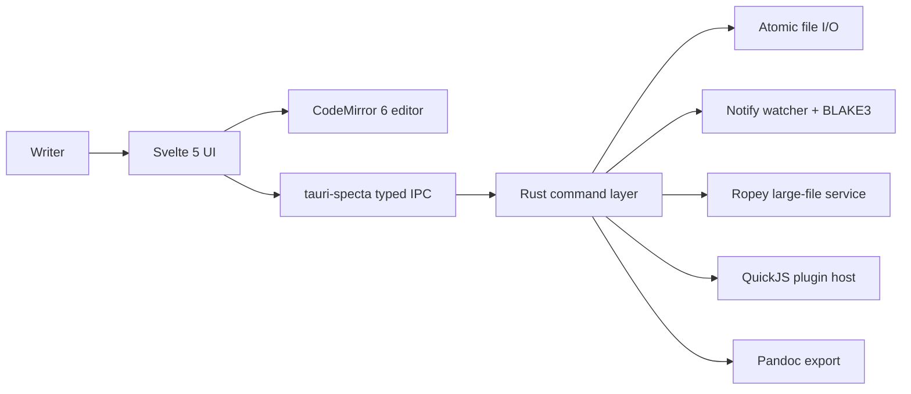

# Novelist Architecture

Last updated: 2026-04-25

Novelist is a local-first desktop writing app built as a Tauri v2 shell
around a Svelte 5 UI and a Rust service layer. The app keeps writing data
as plain files, uses CodeMirror 6 for WYSIWYG Markdown editing, and pushes
filesystem, export, file watching, plugin sandboxing, and large-file work
into Rust.

## Current Status

The project is past MVP and is in a v0.2.x hardening phase.

- Release version in source: `0.2.1`.
- Frontend surface: 134 TypeScript/Svelte source files under `app/lib`.
- Backend surface: 41 Rust source files under `core/src`.
- Tests: 68 unit test files, 3 integration test files, 20 browser E2E specs.
- CI: macOS full gate plus Linux Rust gate in `.github/workflows/ci.yml`.
- Core product features are implemented: WYSIWYG Markdown editor, project
  tree, tabs, split view, zen/focus flows, templates, snapshots, stats,
  export, settings overlay, native canvas/kanban file editors, and mindmap
  overlay.

## System Shape

## Load-Bearing Boundaries

- `app/lib/ipc/commands.ts` is generated by tauri-specta. Never edit it by
  hand.
- `app/lib/app-commands.ts` is the only command registration site.
- Svelte stores own UI state; services orchestrate IPC and avoid reactive
  ownership.
- CodeMirror owns editor state. Svelte wraps it and listens to derived
  signals.
- Rust owns filesystem access, atomic writes, watcher state, export, sync,
  and plugin execution.
- CJK behavior is product-critical, not an edge case.

## Deep Dives

- Editor: [docs/design-docs/editor.md](docs/design-docs/editor.md)
- File lifecycle: [docs/design-docs/file-lifecycle.md](docs/design-docs/file-lifecycle.md)
- Plugin system: [docs/design-docs/plugin-system.md](docs/design-docs/plugin-system.md)
- Settings: [docs/design-docs/settings.md](docs/design-docs/settings.md)
- Testing: [docs/design-docs/testing.md](docs/design-docs/testing.md)
- Feature boundaries: [docs/design-docs/feature-boundaries.md](docs/design-docs/feature-boundaries.md)
- Reliability: [docs/RELIABILITY.md](docs/RELIABILITY.md)
- Security: [docs/SECURITY.md](docs/SECURITY.md)
